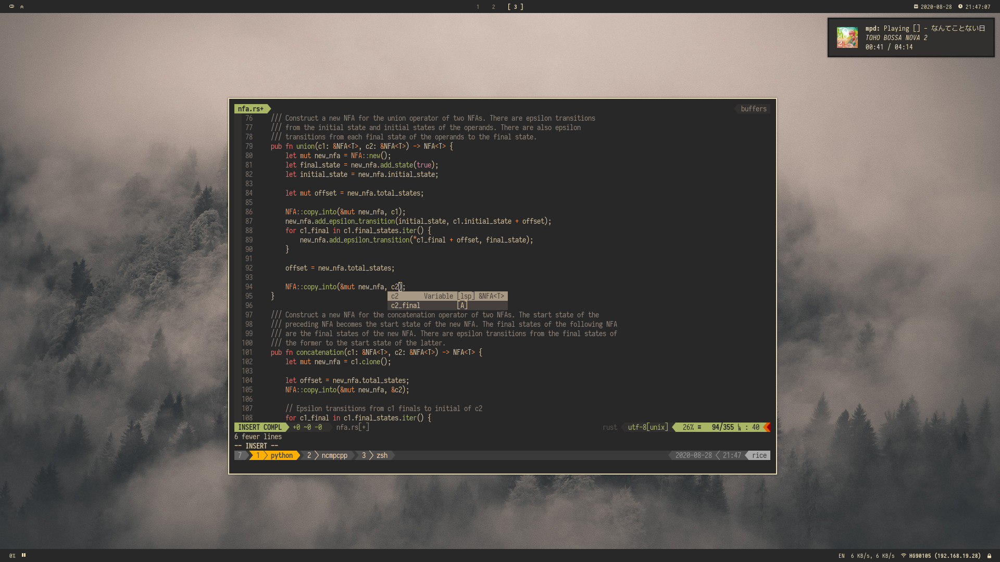

# dotfiles

The dotfiles for my Linux machines, managed by
[`stew`](https://github.com/Dophin2009/stew).

Each subdirectory is a package. Each package has its own set of
configuration files. Some packages require the specification of
other local variables in local configuration files. Some packages
list other packages as prerequesites.

Most of the package documentation is outdated.

- [Installation](#installation)
- [Profiles](#profiles)
- [To-Do](#to-do)

## Installation

1.  Install `stew`: `cargo install --git https://github.com/Dophin2009/stew --features unsafe`
2.  Clone this repo somewhere (e.g. `~/.dotfiles`).
3.  Compile dependencies: `make prepare`
4.  Link the desired packages: `stew <package>`.

## Profiles

Some boring choices, I know.

| Name      | Description                                                           | Dependencies                                                                                   | Screenshot                             |
| :-------- | :-------------------------------------------------------------------- | :--------------------------------------------------------------------------------------------- | :------------------------------------- |
| `gruvbox` | Uses the [gruvbox](https://github.com/morhetz/gruvbox) colorscheme.   | [Iosevka Nerd Font](https://github.com/ryanoasis/nerd-fonts/tree/master/patched-fonts/Iosevka) |  |
| `nord`    | Uses the [nord](https://github.com/arcticicestudio/nord) colorscheme. | [Iosevka Nerd Font](https://github.com/ryanoasis/nerd-fonts/tree/master/patched-fonts/Iosevka) |        |

The wallpapers are not included in the repository.

## To-Do

- [ ] Update documentation for new configuration setup.
- [x] Remove hard-coding of `~/files/` and eventually `user-dirs`.
- [ ] Maybe remove unused packages that do only XDG compliance fixes.
- [x] Make more modular and more customizable.
- [ ] Complete documentation of local variables.
- [ ] Split documentation into files in packages?
