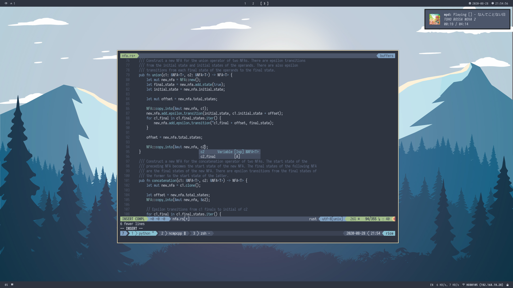

# dotfiles

The dotfiles for my Linux machines, managed by
[`stew`](https://github.com/Dophin2009/stew).

Each subdirectory is a package. Each package has its own set of
configuration files. Some packages require the specification of
other local variables in local configuration files. Some packages
list other packages as prerequesites.

- [Installation](#installation)
- [Profiles](#profiles)
- [Base Packages](#base-packages)
- [Dev Packages](#dev-packages)
- [CLI Packages](#cli-packages)
  - [Neovim](#neovim)
  - [Other Packages](#other-packages)
- [GUI Packages](#gui-packages)
  - [X11](#x11)
  - [i3](#i3)
  - [Polybar](#polybar)
  - [Other Packages](#other-packages-1)
- [Distro Packages](#distro-packages)
- [To-Do](#to-do)

## Installation

Clone this repo somewhere (e.g. `~/.dotfiles`).

Link the desired packages with `stew <package>`.

## Profiles

Some boring choices, I know.

| Name      | Description                                                           | Dependencies                                                                                   | Screenshot                        |
| :-------- | :-------------------------------------------------------------------- | :--------------------------------------------------------------------------------------------- | :-------------------------------- |
| `gruvbox` | Uses the [gruvbox](https://github.com/morhetz/gruvbox) colorscheme.   | [Iosevka Nerd Font](https://github.com/ryanoasis/nerd-fonts/tree/master/patched-fonts/Iosevka) |  |
| `nord`    | Uses the [nord](https://github.com/arcticicestudio/nord) colorscheme. | [Iosevka Nerd Font](https://github.com/ryanoasis/nerd-fonts/tree/master/patched-fonts/Iosevka) |        |

The wallpapers are not included in the repository.

## Dev Packages

| Name      | Package Dep. | Application / Dependencies                                              | Usage / Description                                                                                               | Customization                                                                           |
| :-------- | :----------- | :---------------------------------------------------------------------- | :---------------------------------------------------------------------------------------------------------------- | :-------------------------------------------------------------------------------------- |
| `android` | `sh`         | `android`                                                               | Sets `ANDROID_SDK_HOME` to use XDG data.                                                                          |                                                                                         |
| `cargo`   | `sh`         | [`cargo`](https://github.com/rust-lang/cargo)                           | Sets `CARGO_HOME` to use XDG data.                                                                                |                                                                                         |
| `docker`  | `sh`         | [`docker`](https://www.docker.com/)                                     | Sets `DOCKER_CONFIG` to use XDG config.                                                                           |                                                                                         |
| `dotnet`  | `sh`         | [`dotnet`](https://dotnet.microsoft.com/)                               | Sets `DOTNET_CLI_TELEMETRY_OPTOUT` to true.                                                                       |                                                                                         |
| `ghcup`   | `sh`         | [`ghcup`](https://gitlab.haskell.org/haskell/ghcup-hs)                  | Sets `GHCUP_INSTALL_BASE_PREFIX` to use XDG data.                                                                 |                                                                                         |
| `git`     | `sh`         | [`git`](https://git-scm.com/), [`fzf`](https://github.com/junegunn/fzf) | Minimal git configuration file + git aliases (`gcmsg`, `gl`, `gp`, etc). The alias `gdiff` requires `fzf`.        | `.config/git/config.local` should be created with credentials under `[user]` if needed. |
| `gradle`  | `sh`         | [`gradle`](https://gradle.org/)                                         | Sets `GRADLE_USER_HOME` to use XDG data.                                                                          |                                                                                         |
| `java`    | `sh`         | [`java`](https://www.java.com/)                                         | Sets `_JAVA_OPTIONS` to set prefs root to XDG config.                                                             |                                                                                         |
| `maven`   | `sh`         | [`maven`](https://maven.apache.org/)                                    | Aliases mvn to always use configuration file at XDG config.                                                       |                                                                                         |
| `mysql`   | `sh`         | [`mysql`](https://www.mysql.com/)                                       | XDG env fix: `MYSQL_HISTFILE` to use XDG data.                                                                    |                                                                                         |
| `npm`     | `sh`         | [`npm`](https://github.com/npm/cli)                                     | Directs `npm` to use `npmrc` in XDG config.                                                                       |                                                                                         |
| `nuget`   | `sh`         | [`nuget`](https://www.nuget.org/)                                       | Sets `NUGET_PACKAGES` to use XDG cache.                                                                           |                                                                                         |
| `nvm`     | `sh`         | [`nvm`](https://github.com/nvm-sh/nvm)                                  | Sets `NVM_DIR` to XDG data.                                                                                       |                                                                                         |
| `pgsql`   | `sh`         | [PostgreSQL](https://www.postgresql.org/)                               | Sets `PSQLRC`, `PGPASSFILE`, `PGSERVICEFILE` to use XDG config and `PSQL_HISTORY` to use XDG cache.               |                                                                                         |
| `pylint`  | `sh`         | [`pylint`](https://github.com/PyCQA/pylint)                             | Sets `PYLINTHOME` to XDG cache.                                                                                   |                                                                                         |
| `python`  | `sh`         | [`python`](https://www.python.org/)                                     | Sets `PYTHON_EGG_CACHE` to use XDG cache.                                                                         |                                                                                         |
| `R`       | `sh`         | [`R`](https://www.r-project.org/)                                       | Minimal XDG compliance and convenience `Rprofile` file.                                                           |                                                                                         |
| `ruby`    | `sh`         | [`bundle`](https://bundler.io/), [`gem`](https://rubygems.org/)         | Sets `GEM_HOME`, `GEM_SPEC_CACHE`, `BUNDLE_USER_CONFIG`, `BUNDLE_USER_CACHE`, `BUNDLE_USER_PLUGIN` to follow XDG. |                                                                                         |
| `rustup`  | `sh`         | [`rustup`](https://github.com/rust-lang/rustup)                         | Sets `RUSTUP_HOME` to XDG data.                                                                                   |                                                                                         |
| `stack`   | `sh`         | [`stack`](https://github.com/commercialhaskell/stack)                   | Sets `STACK_ROOT` to XDG data.                                                                                    |                                                                                         |
| `texlive` | `sh`         | [TeX Live](http://tug.org/texlive/)                                     | Adds a TeX Live full install profile to `.config/texlive`.                                                        |                                                                                         |

## CLI Packages

## Neovim

Configuration using `vim-plug`, `nvim-lsp`, `deoplete.nvim`, `ranger.vim`, `vim-airline`, and more. The unreleased `v0.5` of Neovim.

**Dependencies**:

- [`neovim` v0.5 nightly](https://github.com/neovim/neovim)
- [`nodejs`](https://nodejs.org/en/)
- [`yarn`](https://github.com/yarnpkg/yarn)
- [`python3`](https://www.python.org/)
- [`pip3`](https://pip.pypa.io/en/stable/)

### Other Packages

| Name         | Package Dep. | Application / Dependencies                                                                                      | Usage / Description                                                                                                              | Customization                                                       |
| :----------- | :----------- | :-------------------------------------------------------------------------------------------------------------- | :------------------------------------------------------------------------------------------------------------------------------- | :------------------------------------------------------------------ |
| `bat`        |              | [`bat`](https://github.com/sharkdp/bat)                                                                         | Templated configuration that uses profile theme.                                                                                 |                                                                     |
| `beets`      | `sh`         | [`beets`](https://github.com/beetbox/beets), [`beets-playlistc`](https://github.com/Dophin2009/beets-playlistc) | Templated configuraiton with some plugins. Adds some related aliases.                                                            | Must specify local `dotprofile` vars: `local.beets.root_dir`        |
| `bitwarden`  | `sh`         | [`bitwarden`](https://bitwarden.com/)                                                                           | Sets `BITWARDEN_APPDATA_DIR` and `BITWARDENCLI_APPDATA_DIR` to use XDG data.                                                     |                                                                     |
| `cursedtag`  |              | [`cursedtag`](https://github.com/hellricer/cursedtag)                                                           | rc file that adds some more fields.                                                                                              |                                                                     |
| `dicth`      | `sh`         | [`dictd`](https://sourceforge.net/projects/dict/), [`aiksaurus`](https://github.com/AbiWord/aiksaurus)          | Adds aliases `def` and `th` to query a `dictd` server with WordNet dictionary and `aiksaurus`.                                   |                                                                     |
| `elinks`     | `sh`         | [`elinks`](http://elinks.or.cz/)                                                                                | Basically default configuration with DuckDuckGo bookmark and smart rewrite.                                                      |                                                                     |
| `gnupg`      | `sh`         | [`gnupg`](https://gnupg.org/)                                                                                   | Sets `GNUPGHOME` and `PGPPATH` to use XDG data.                                                                                  |                                                                     |
| `hangups`    |              | [`hangups`](https://github.com/tdryer/hangups)                                                                  | Templated configuration with some keybinds and profile-specific theme.                                                           |                                                                     |
| `ibus`       | `sh`         | [`ibus`](https://github.com/phuang/ibus)                                                                        | Sets `GTK_IM_MODULE`, `XMODIFIERS`, and `QT_IM_MODULE` to `ibus`.                                                                |                                                                     |
| `less`       | `sh`         | `less`                                                                                                          | Sets `LESSHISTFILE` to use XDG cache.                                                                                            |                                                                     |
| `mpd`        | `sh`         | [`mpd`](https://github.com/MusicPlayerDaemon/MPD)                                                               | Minimal configuration with ALSA and FIFO outputs + some convenience aliases.                                                     |                                                                     |
| `mullvad`    | `sh`         | [`mullvad`](https://github.com/mullvad/mullvadvpn-app)                                                          | Adds Mullvad VPN cli aliases.                                                                                                    |                                                                     |
| `mutt`       |              | [`neomutt`](https://github.com/neomutt/neomutt), [`elinks`](http://elinks.or.cz/)                               | Configuration with some vim-like keybinds and use of elinks for html dumps.                                                      | Configure accounts in `.config/mutt/accounts`.                      |
| `ncmpcpp`    | `mpd`        | [`ncmpcpp`](https://github.com/ncmpcpp/ncmpcpp)                                                                 | Plain configuration with somewhat colorful UI                                                                                    |                                                                     |
| `newsboat`   |              | [`newsboat`](https://github.com/newsboat/newsboat)                                                              | Minimal newsboat configuration file.                                                                                             | Populate `.config/newsboat/urls` with feed urls.                    |
| `notmuch`    | `sh`         | [`notmuch`](https://notmuchmail.org/)                                                                           | Sets `NOTMUCH_CONFIG` and `NMBGIT` to be XDG compliant.                                                                          | Configure `notmuch` in `.config/notmuch/notmuchrc`.                 |
| `pass`       | `sh`         | [`pass`](https://www.passwordstore.org/)                                                                        | Sets `PASSWORD_STORE_DIR` to use XDG data.                                                                                       |                                                                     |
| `ranger`     | `sh`         | [`ranger`](https://github.com/ranger/ranger), [`fasd`](https://github.com/clvv/fasd)                            | Basically default configuration with fasd logging.                                                                               |                                                                     |
| `sh`         |              | POSIX shells                                                                                                    | Shared shell configurations for POSIX shells.                                                                                    | Additional configuration can be placed in `.config/sh/local`.       |
| `task`       | `sh`         | [`taskwarrior`](https://taskwarrior.org/)                                                                       | Templated almost-default configuration that changes theme based on profile.                                                      |                                                                     |
| `tmux`       | `sh`         | [`tmux`](https://github.com/tmux/tmux), [`fzf`](https://github.com/junegunn/fzf)                                | Configuration with a couple vim-like keybinds and plugins.                                                                       |                                                                     |
| `urlview`    |              | [`urlview`](https://packages.qa.debian.org/u/urlview.html), [`elinks`](http://elinks.or.cz)                     | urlview configuration that opens urls in qutebrowser.                                                                            |                                                                     |
| `weechat`    | `sh`         | [`weechat`](https://weechat.org/)                                                                               | Sets `WEECHAT_HOME` to use XDG config.                                                                                           | Actual weechat configuration can be specified in `.config/weechat`. |
| `wget`       | `sh`         | `wget`                                                                                                          | Sets `WGETRC` and aliases `wget` to be XDG compliant.                                                                            | Actual configuration can be specified in `.config/wget/wgetrc`.     |
| `wine`       | `sh`         | [`wine`](https://www.winehq.org/)                                                                               | Sets default prefix location to `$XDG_DATA_HOME/wine/pfx/default`.                                                               |                                                                     |
| `youtube-dl` | `sh`         | [`youtube-dl`](https://github.com/ytdl-org/youtube-dl)                                                          | Adds some relevant aliases.                                                                                                      |                                                                     |
| `zsh`        | `sh`, tmux`  | [`zsh`](https://github.com/zsh-users/zsh)                                                                       | Prompt configuration using [`zinit`](https://github.com/zdharma/zinit), [`p10k`](https://github.com/romkatv/powerlevel10k), etc. |
| `user-dirs`  |              | Default file directory configuration.                                                                           |                                                                                                                                  |

## GUI Packages

### X11

Usage: `startx "$XDG_CONFIG_HOME/X11/xinitrc" -- "$XDG_CONFIG_HOME/X11/xserverrc" <vt>`

**Package Dependencies**:

- `set-brightness`
- `i3`

**Dependencies**:

- [`X11`](https://www.x.org/wiki/)
  - `X`, `startx`, `xrdb`, `xset`

**Customization**:

Before starting the window manager, `xinitrc` will look for `xinitrc.local`.
`make X11` will automatically link `local/X11/xinitrc.local` to the proper
location if it exists.

### i3

An pretty personalized i3-gaps configuration for up to 2 monitors.

**Local Variables** (see [Installation](#installation))

| Name                    | Description                   | Optional? |
| :---------------------- | :---------------------------- | :-------- |
| `local.i3.primary`      | Name of the primary monitor   | no        |
| `local.i3.secondary`    | Name of the secondary monitor | no        |
| `local.i3.lock_command` | Command to lock the screen    | yes       |

To get monitor names, try `xrandr --query \| grep " connected" \| cut -d" " -f1`.

**Package Dependencies**:

- `polybar`
- `wallpaper`
- `fscreenshot`

**Dependencies**:

- [`i3-gaps`](https://github.com/Airblader/i3)
- [`alacritty`](https://github.com/alacritty/alacritty)
- [`dunst`](https://github.com/dunst-project/dunst)
- [`mpd`](https://github.com/MusicPlayerDaemon/MPD)
- [`mpdnotify`](https://github.com/Dophin2009/mpdnotify)
- [`networkmanager-dmenu`](https://github.com/firecat53/networkmanager-dmenu)
- [`pulseaudio`](https://www.freedesktop.org/wiki/Software/PulseAudio/)
- [`rofi`](https://github.com/davatorium/rofi)

### Polybar

Create `polybar/.config/polybar/local.ini` to specify the modules used:

    [modules]
    top-left = animated-wallpaper pacman-yay-updates
    top-center = i3
    top-right = date
    bottom-left = audio mpd
    bottom-center =
    bottom-right = keyboard ibus network mullvad

**Package Dependencies**:

- **Dependencies**:

- [`polybar`](https://github.com/polybar/polybar)
- [`xrandr`](https://xorg.freedesktop.org/wiki/)
- [Font Awesome 5](https://fontawesome.com/)
- [Hack font](https://github.com/source-foundry/Hack)

**Optional Dependencies** (depending on module usage):

| Name                                                                  | Module               |
| :-------------------------------------------------------------------- | :------------------- |
| [`i3wm`](https://i3wm.org)                                            | `i3`                 |
| [`ibus`](https://github.com/phuang/ibus)                              | `ibus`               |
| [`mpd`](https://github.com/MusicPlayerDaemon/MPD)                     | `mpd`                |
| [`mullvad`](https://github.com/mullvad/mullvadvpn-app)                | `mullvad`            |
| [`pulseaudio`](https://www.freedesktop.org/wiki/Software/PulseAudio/) | `audio`              |
| [`pacman`](https://www.archlinux.org/pacman/)                         | `pacman-yay-updates` |
| [`yay`](https://github.com/Jguer/yay)                                 | `pacman-yay-updates` |

### Other Packages

| Name                             | Package Dep.     | Dependencies                                                                                                                                                                     | Usage / Description                                                                                            | Customization                                               |
| :------------------------------- | :--------------- | :------------------------------------------------------------------------------------------------------------------------------------------------------------------------------- | :------------------------------------------------------------------------------------------------------------- | :---------------------------------------------------------- |
| `alacritty`                      |                  | [`alacritty`](https://github.com/alacritty/alacritty)                                                                                                                            | Templated configuration that uses profile colors and font.                                                     |                                                             |
| `battery-notify`                 | `sh`             | `notify-send` from `libnotify`                                                                                                                                                   | Adds battery notification scripts to .local/bin                                                                |                                                             |
| `battery-notify/systemd-service` | `battery-notify` | `systemd`                                                                                                                                                                        | A systemd service file for `battery-notify`.                                                                   |                                                             |
| `dunst`                          |                  | [`dunst`](https://github.com/dunst-project/dunst)                                                                                                                                | Templated configuration that uses profile colors and font.                                                     |                                                             |
| `fscreenshot`                    | `sh`             | [`scrot`](https://phab.enlightenment.org/diffusion/ESVN/browse/trunk/misc/scrot;35502)                                                                                           | Adds script to take screenshot to /tmp/<timestamp>.png with scrot.                                             |                                                             |
| `gimp`                           | `sh`             | [`gimp`](https://gitlab.gnome.org/GNOME/gimp)                                                                                                                                    | Sets `GIMP2_DIRECTORY` to be XDG compliant.                                                                    |                                                             |
| `gtk`                            | `sh`             | [`git`](https://git-scm.com)                                                                                                                                                     | Profile-specific GTK themes, XDG compliance environment variables, and GTK 2 file chooser config.              |                                                             |
| `lock-screen`                    | `sh`             | [`i3lock`](https://github.com/i3/i3lock)                                                                                                                                         | Adds script to lock screen using `i3lock`, with pixelated screenshot of the current screen as the screensaver. |                                                             |
| `mpdnotify`                      | `mpd`            | [`mpdnotify`](https://github.com/Dophin2009/mpdnotify)                                                                                                                           | MPD notication daemon.                                                                                         |                                                             |
| `mpdnotify/systemd-service`      | `mpdnotify`      | `systemd`                                                                                                                                                                        | A systemd service file for `mpdnotify`.                                                                        |                                                             |
| `mplayer`                        | `sh`             | [`mplayer`](http://mplayerhq.hu/design7/news.html)                                                                                                                               | Sets `MPLAYER_HOME` to XDG config.                                                                             | Actual configuration can be specified at `.config/mplayer`. |
| `networkmanager-dmenu`           |                  | [`networkmanager-dmenu`](https://github.com/firecat53/networkmanager-dmenu), [`rofi`](https://github.com/davatorium/rofi), [`alacritty`](https://github.com/alacritty/alacritty) | Configuration to use with `rofi` and `alacritty`.                                                              |                                                             |
| `qutebrowser`                    |                  | [`qutebrowser`](https://github.com/qutebrowser/qutebrowser), [`python-inotify`](https://pypi.org/project/inotify/)                                                               | Templated configuration with profile colors, some greasemonkey scripts, and custom search engines.             |                                                             |
| `rofi`                           |                  | [`rofi`](https://github.com/davatorium/rofi), [`alacritty`](https://github.com/alacritty/alacritty)                                                                              | Templated configuration with theme based on profile; to be used with alacritty.                                |                                                             |
| `set-brightness`                 | `sh`             | [`xrandr`](https://xorg.freedesktop.org/wiki/)                                                                                                                                   | Adds script to set brightness from 0.0 to 1.0 on all monitors using `xrandr`.                                  |                                                             |
| `steam`                          | `sh`             | [`steam`](https://store.steampowered.com/); (make: [`git`](https://git-scm.com), `wget`, `unzip`)                                                                                | Installs the metro-for-steam skin and the UPMetroSkin patch for Steam.                                         |                                                             |
| `terminfo`                       | `sh`             | `terminfo`                                                                                                                                                                       | Sets `TERMINFO` to be XDG compliant.                                                                           |                                                             |
| `termite`                        |                  | [`termite`](https://github.com/thestinger/termite)                                                                                                                               | Templated configuration to use profile colors and font.                                                        |                                                             |
| `wallpaper`                      | `sh`             | [`feh`](https://feh.finalrewind.org/), [`paperview`](https://github.com/glouw/paperview)                                                                                         | Adds script to play and pause animated wallpaper, or use still wallpaper at `$XDG__CONFIG_HOME/wallpaper`.     |                                                             |
| `zathura`                        |                  | [`zathura`](https://git.pwmt.org/pwmt/zathura)                                                                                                                                   | Bare config with keybinds to reload and recolor to inverted colors.                                            |                                                             |
| `zprofile`                       | `X11`            | [`zsh`](https://github.com/zsh-users/zsh)                                                                                                                                        | Login shell profile to launch X11 server.                                                                      |                                                             |

## Distro Packages

These are packages for specific distros.

| Name     | Distro       | Package Dep. | Dependencies                                       | Usage / Description                                                          | Customization |
| :------- | :----------- | :----------- | :------------------------------------------------- | :--------------------------------------------------------------------------- | :------------ |
| `pacman` | pacman-based | `sh`         | `pacman`, [`fzf`](https://github.com/junegunn/fzf) | Adds the alias `pacman-browse-pkgs` to browse installed packages with `fzf`. |               |

## To-Do

- [ ] Update documentation for new configuration setup.
- [x] Remove hard-coding of `~/files/` and eventually `user-dirs`.
- [ ] Maybe remove unused packages that do only XDG compliance fixes.
- [x] Make more modular and more customizable.
- [ ] Complete documentation of local variables.
- [ ] Split documentation into files in packages?
